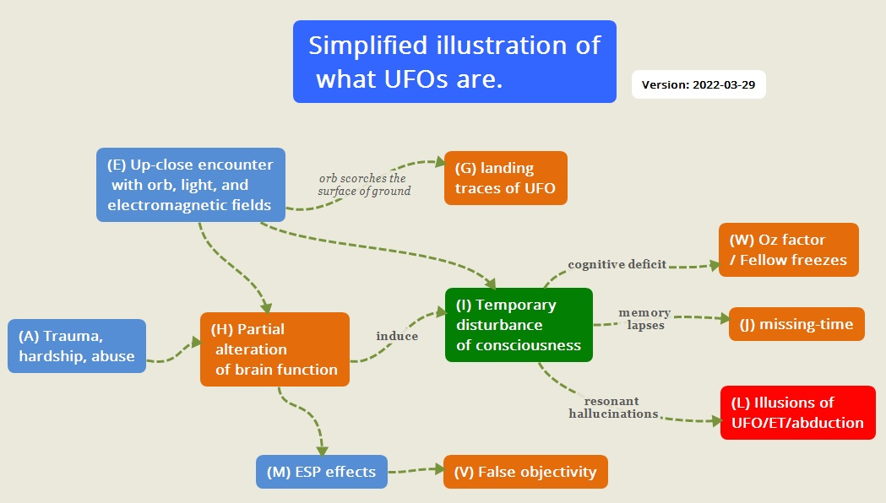

# Simplified illustration of what UFOs are.

## preface
I propose a hypothesis (HoTDoc) that solves the UFO mystery.

This hypothesis offers the prospect of a reasonable solution to the following mysteries.

## UFO misteries
<dl>
<dt>Q1
<dd>フットボール競技場のサイズに匹敵するような巨大な UFO が低空に浮遊していたという目撃証言が多数あるのに、なぜ付近の住人はだれもその UFO を目撃していないのか？

<dt>Q2
<dd>なぜ一緒に UFO を目撃した仲間の証言が大きく食い違うのか？ 人によって UFO の形状が大きく異っていたり、あるいは全く見えていなかったりするのはなぜか？

<dt>Q3
<dd>なぜ、どのようにして "missing-time" 現象が生じるのか？

<dt>Q4
<dd>なぜ、UFO や ET を目撃する直前に orb や青い光を目撃する事例が多いのか？

<dt>Q5
<dd>なぜ、UFO を撮影しようとするとカメラの電池が空になっていたり、正常に動作しないのか？

<dt>Q6
<dd>なぜ、UFO と Bigfoot が同時に目撃される事例があるのか？

<dt>Q7
<dd>なぜ UFO 現象には "Oz factor" が頻繁に伴うのか？

<dt>Q8
<dd>なぜ UFO の中で故人となった親類や縁者に遭遇するのか？

<dt>Q9
<dd>なぜ abdcutee は OBE を同時に体験することがあるのか？

<dt>Q10
<dd>なぜ ET に対面した時に以下のような体験をするのか？
  <ul>
  <li>"download" 体験
  <li>無条件の愛を ET から感じる
  <li>全てはひとつという実感
  <li>宇宙の全ての謎の解答を得たと実感
  <li>脳裏を多数の映像が高速で流れる現象
  </ul>
	
<dt>Q11
<dd>なぜ、abductee は abduction 体験後に ESP 能力に目覚めるのか。なぜ、ポルターガイスト現象が多発するようになるのか？

<dt>Q12
<dd>UFO や ET に遭遇した目撃者が「家族や仲間が凍りついたように停止していた」と証言するのは、どうしてか？

<dt>Q13
<dd>なぜ、目撃される UFO や ET の外見が時代と共に大きく変化してきたのか？

<dt>Q14
<dd>なぜ、1950年代に反重力装置の実用化が目前だと大々的にマス・メディアで報じられ、数年後には立ち消えになったのか？

<dt>Q15
<dd>なぜ、Skinwalker ranch では UFO と超常現象が頻発しているのか？

<dt>Q16
<dd>なぜ "screen memory" と呼ばれる現象が頻繁に報告されているのか？
</dl>

## 仮説

- UFO/ET/abduction 現象は、特殊な意識障害(TDC : Temporary Disturbance of Consciousness) と共鳴的認知(RR: Resonant Recognition)によって生じている。

- この特殊な意識障害は、現場の orb やフラッシュ光などの EMF 異常によって引き起こされる。EMF 異常は脳機能の変質という後遺症を伴うことがある。

## the answer

<dl>
<dt>Q
<dd>フットボール競技場のサイズに匹敵するような巨大な UFO が低空に浮遊していたという目撃証言が多数あるのに、なぜ付近の住人はだれもその UFO を目撃していないのか？
<dt>A
<dd>その UFO は実在せず、特殊な意識障害(HoTDoC : 仮説)によって目撃者の脳内映像として生じた UFO の幻覚だから。

<dt>Q
<dd>幻覚なら現場に居合わせた複数の目撃者が同じ UFO を目撃する筈がないのではないか？

<dt>A
<dd>通常の幻覚なら確かにそうだ。だが、UFO 絡みの特殊な意識障害では共鳴的認知が働く（共鳴的認知仮説）。そのため、互いに同じような光景の幻覚を見やすくなる。

<dt>Q2
<dd>なぜ一緒に UFO を目撃した仲間の証言が大きく食い違うのか？ 人によって UFO の形状が大きく異っていたり、あるいは全く見えていなかったりするのはなぜか？
<dt>A2
<dd>UFO 目撃者の間では共鳴的認知が働くため、互いに似たような光景を目撃しやすい。

</dl>

Orb/light/EMF ---> disturbance of consciousness ---> illusion of UFOs

## key point
- Orb/light/EMF causes temporary disturbance of consciousness, which in turn creates UFO hallucinations. 

- There is no "unknown intelligence" behind the UFO phenomenon.

## Simplified illustration

(A) Trauma, hardship, abuse

(E) Up-close encounter with the orb, light, and electromagnetic fields

(G) landing traces of UFO

(H) Partial alteration  of brain function

(I) Temporary disturbance of consciousness

(J) missing-time

(L) Illusions of UFO/ET/abduction

(M) ESP effects

(V) False objectivity

(W) Oz factor / Fellow freezes

## related previous article
- A more detailed illustrative article is linked below.

The key to understanding the UFO/Bigfoot phenomenon is the temporary disturbance of consciousness. - <a href="http://news21c.blog.fc2.com/blog-entry-19260.html" target="_blank">http://news21c.blog.fc2.com/blog-entry-19260.html</a>  (2022-03-27)

## Thanks
- Translated with www.DeepL.com/Translator (free version)

(2022-03-29)

