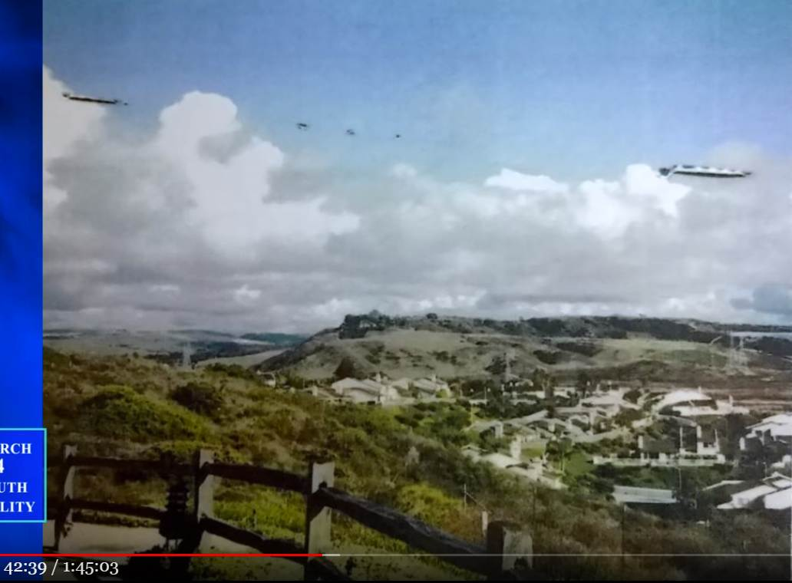
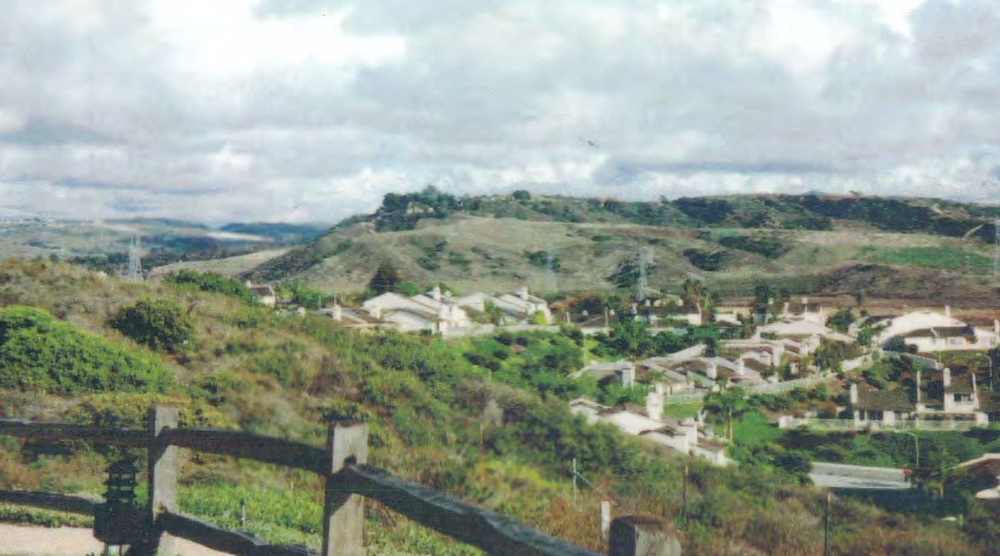
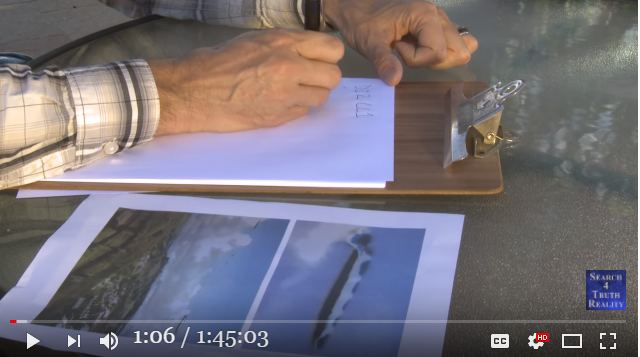
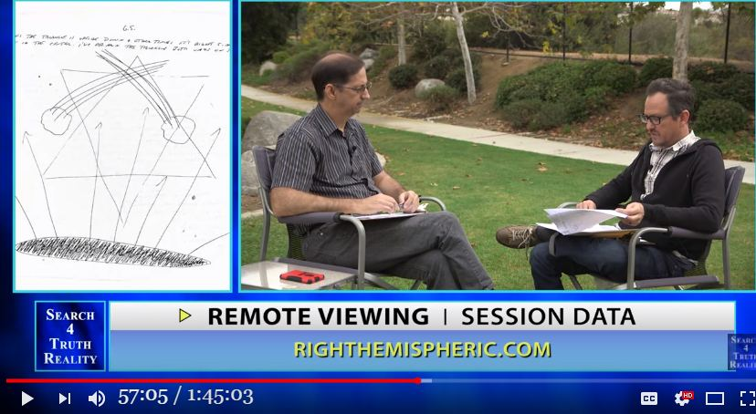
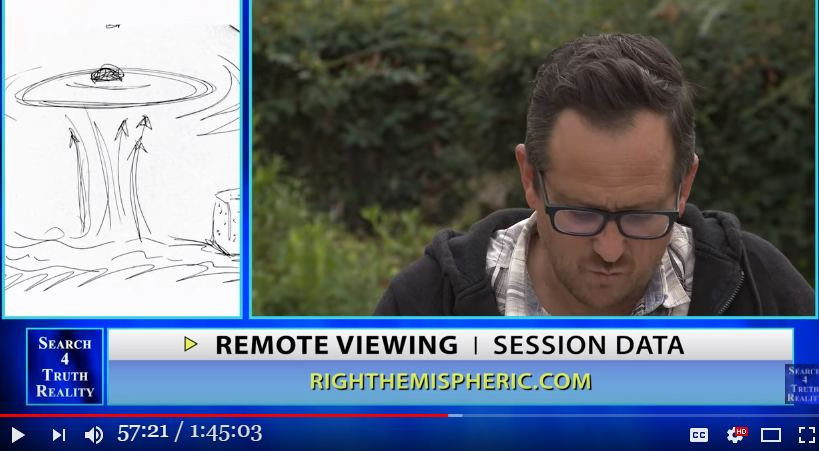
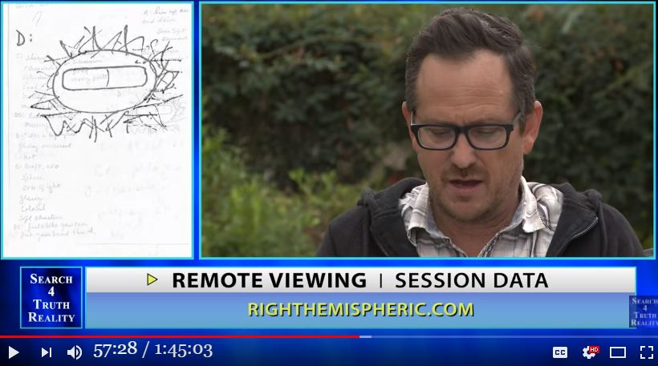
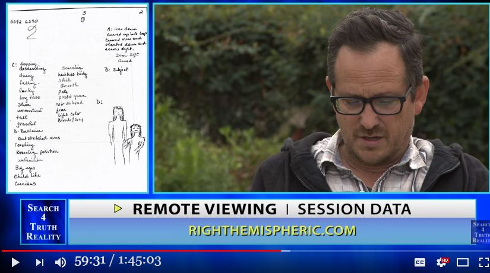
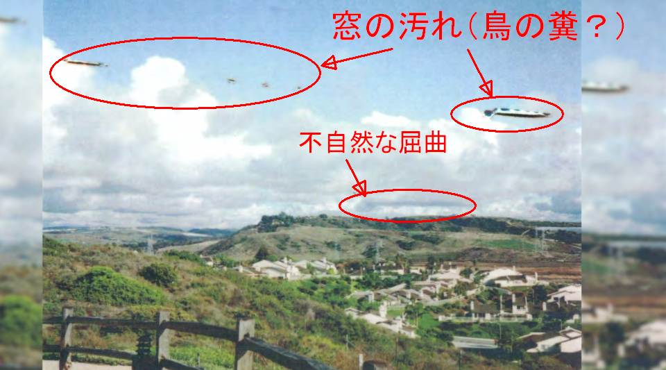

# William Tompkins の「UFO 写真」の正体（＋遠隔視の実態）

<pre>

<h3>Update</h3>
・（2018-07-08）完結。

・（2018-07-01）追加。

・（2018-06-29）追加。
　　・撮影状況に言及した記事を追加。
　　・ついでにタイトルを修正。修正前のタイトルは…
　　　　John Vivanco：William Tompkins の撮影した UFO は本物だ…と遠隔視の結果から断言できる。（その UFO の正体は…w）

<h3>はじめに</h3>
・遠隔視が全く信用できないという決定的な証拠を見かけたので記録しておく。

<h3>抜粋（デタラメ）</h3>
・42:36 William Tompkins <s>の撮影</s> が知人女性から入手した UFO 写真が下。

・私（John Vivanco）は、このような UFO 写真を見せられたら、まず最初に捏造を疑う。だが、これは銀塩フィルムによる撮影だし、なにより…

・47:50 熟練者を含む 7名の遠隔視実演者がこの写真の UFO を遠隔視した。最初に写真を捏造するシーンを遠隔視してみたが、そのようなシーンは出てこなかった。

・数字だけを与えられた遠隔視演者は皆、本物の UFO の様々なシーンを見た。

・以上の結果を総合すると、これはリアルな UFO だと断言できる。

…
…
…
…

<h3>動画（1:45:03）</h3>
・Remote Viewing Psychic Spy John Vivanco - Part 3
<iframe allow="autoplay; encrypted-media" allowfullscreen="" frameborder="0" height="315" src="https://www.youtube.com/embed/NXvT0OC98Nc" width="560"></iframe>

<h3>コメント</h3>
・John Vivanco は自信たっぷりに、この写真はリアルな UFO だと断言している。だが、この UFO の正体を知るのに遠隔視なんて余計なことは不要。よほどの節穴でない限り、ひと目でこの UFO の正体に気づく。

・この UFO の正体を示す「明白かつ決定的な証拠」がこの写真に露骨に写っている。それも 2つや 3つの証拠ではない。ざっと数えただけで 20個近くの証拠が目につく。

…
…
…
…

(2018-06-26)

（以下、2018-06-29 追加分）

<h3>はじめに</h3>
・William Tompkins  が、以下を取り上げ、解説しているインタビュー記事を見かけたので追加しておく。

　　・問題の写真の映像。
　　・この写真の由来。
　　・この UFO は爬虫類型 ET の巨大タンカーで、一時的に不可視化を解除したシーンだ。
　　・その他、タワゴトの羅列

・下の写真は上の切り出し静止画と同じものだが、若干 鮮明になっている。なので後日、図解するときには下の写真の方を用いる。

・"google image search" していたら以下の引用箇所を含んだ日本語訳が偶然ヒット。誤訳も混じっているようだが（例："Lake Boulevard" を湖の名前としたり、cul-de-sac を洞窟としたり…）、全体の感じはつかめる筈。

　　参考の日本語訳　：  <a href="https://keen-area.net/?id=351" target="_blank">https://keen-area.net/?id=351</a>

<h3>引用</h3>
<blockquote>
 <h4>MIND CONTROL</h4>
Tompkins: I was in a meeting on the subject with some other people, and this one young lady said, “I've got one.”

And, “You've got what?”

[Whispering] “I've got one.”

“Really?”

“I have.”

“I've got a picture of it.”

“UFO?”

“Yeah. A real picture of it.”

“How'd you get that?”

“Well, we were having a party Friday night in Oceanside, and Saturday morning we went - all eight of us - we went to that cul-de-sac off of Lake Boulevard” - it's right over at Carlsbad. Now Carlsbad is next to Oceanside, okay? So they're standing on the border between the two - to show the other three couples their new condo that's being built just across the area.

So everybody goes out there, and they're standing around this fence because it dropped off quite a bit and then came back up.

 

 

So they took the picture, one picture of this whole valley thing - not a picture like that [pointing up like to the sky], but just straight out.

And they developed the pictures, all the party pictures the night before, and then this.

You'll notice it's serrated on the sides and it's serrated on the top.

 

Look what's coming out of the back of it in color - five separate gases coming out of this Reptilian tanker, dropping five gases at 300 feet.

You're smoking their gas today, because they drop this gas only on technically advancing communities on the planet, okay, every four to six weeks. So you could be getting it today.

 

 

Not one - one, two, three, four, five, six. THEY DIDN'T SEE IT, because everybody's minds are controlled to not see it just like a stealth system.

So the commander of this squadron made sure that that stealth was turned on. He forgot to turn on the stealth that prevents a camera from photographing it. Okay?

So the reason you don't see these - they're flying all over us. There's hundreds of them. They're thousands of them every single day on your planet. They're dropping the gas.

So your mind is being controlled, and you don't function normally or how you should function.

And so, again, we are being mind-controlled not for the last couple of weeks but for thousands of years. And back to the Romans again, their minds were controlled.

And it's hard for us to accept that somebody's controlling MY MIND, and particularly - now this is extremely important - particularly because the brilliant PhDs in ALL technical fields, these people are most important for everything that we need in science, but their minds have been controlled.

ref: <a href="https://spherebeingalliance.com/blog/transcript-cosmic-disclosure-remembering-william-tompkins-disrupting-draco-domination.html" target="_blank">https://spherebeingalliance.com/blog/transcript-cosmic-disclosure-remembering-william-tompkins-disrupting-draco-domination.html</a>
</blockquote>

(2018-06-29)

（以下、2018-07-01 追加分）

<h3>はじめに</h3>
・上の 2018-06-26 の記載部分をより詳細化し、切り出し静止画も追加しておく。

<h3>抜粋（デタラメ）</h3>
・1:00 写真の場所は agua hedionda Lagoon in Carlsbad California

・42:36 William Tompkins <s>の撮影</s> が知人女性から入手した UFO 写真が下。

・私（John Vivanco）は、このような UFO 写真を見せられたら、まず最初に捏造を疑う。だが、これは銀塩フィルムによる撮影だし、なにより…

・47:50 熟練者を含む 7名の遠隔視実演者がこの写真の UFO を遠隔視した。最初に写真を捏造するシーンを遠隔視してみたが、そのような捏造を示すシーンは出てこなかった。

・数字だけを与えられた遠隔視演者は皆、本物の UFO の様々なシーンを見た。

・45:36 写真の場所は Agua Hedionda Lagoon in Carlsbad California

・50:08 この UFO は光学的な幻影などではなく、物理的な実体だ。"physically real"

・51:50 この UFO は本物だ。"it's real things."

・59:00 この UFO の様々な具体的データを遠隔視した結果の詳細。

・59:30 この UFO の中に ET がいるのが遠隔視で見えた。

<h3>動画（1:45:03）</h3>
・Remote Viewing Psychic Spy John Vivanco - Part 3
<iframe allow="autoplay; encrypted-media" allowfullscreen="" frameborder="0" height="315" src="https://www.youtube.com/embed/NXvT0OC98Nc" width="560"></iframe>

<h3>コメント</h3>
・次回、この UFO の正体と、その「明白かつ決定的な証拠」を図解する予定。

・ネットでキーワード検索したり、image search したが、この UFO の正体に言及した記事は一つもヒットしなかった。検索が雑なせいもあるだろうが、それにしても…。

・これほどアカラサマに正体を示す証拠が写っているのに誰一人 気づかない…なんてことはありえない。…ということは、この写真をチラリと眺めて一瞥したきりで、誰も注意を払って見ていないに違いない。

・だが、それはそれで健全なことだとも言える。William Tompkins のヨタ話に本気で付き合うような人間はかなりイカれているゆえに…w。 これは William Tompkins のヨタ話に限らない。UFO 全般もそうだし、精神世界全般にも言えること。

(2018-07-01)

（以下、2018-07-08 追加分）

<h3>この UFO の正体を図解</h3>
・最初に、この写真が車の中から撮影された証拠を下の図で示す。

　　・第一に、「窓の汚れ」に注目。
　　・第二に、中央やや上に引いた赤の横線（車内の映り込み）に注目。
　　・第三に、多数の車内の映り込み、特に黒がかった柵の手前に写り込んでいる点に注目。

・上の図解の比較用としてオリジナルの写真を下に示す。

・よって、問題の UFO は鳥の糞の類と断定できる。下図の雲の「不自然な屈曲」のあたりも車内の映り込みや窓の汚れの可能性があるが判然としない。

・念のためと思って、Google map で該当風景を探しかけた。だが、場所を絞るのが困難で、膨大な時間を要するとわかった。なので断念した。あとは暇な人に任せる。

<h3>履歴</h3>
(2018-06-26) 作成
(2018-06-29) 追加
(2018-07-01) 追加
(2018-07-08) 追加

</pre>

## 初出
<a href="http://news21c.blog.fc2.com/blog-entry-12000.html" target="_blank">「William Tompkins の UFO 写真は本物だ」と John Vivanco が遠隔視で断言 →この UFO の正体は…w　（全体）</a> (2018-07-08)
