# Linda Bradshaw が撮影した UFO 写真は捏造。その決定的な証拠。

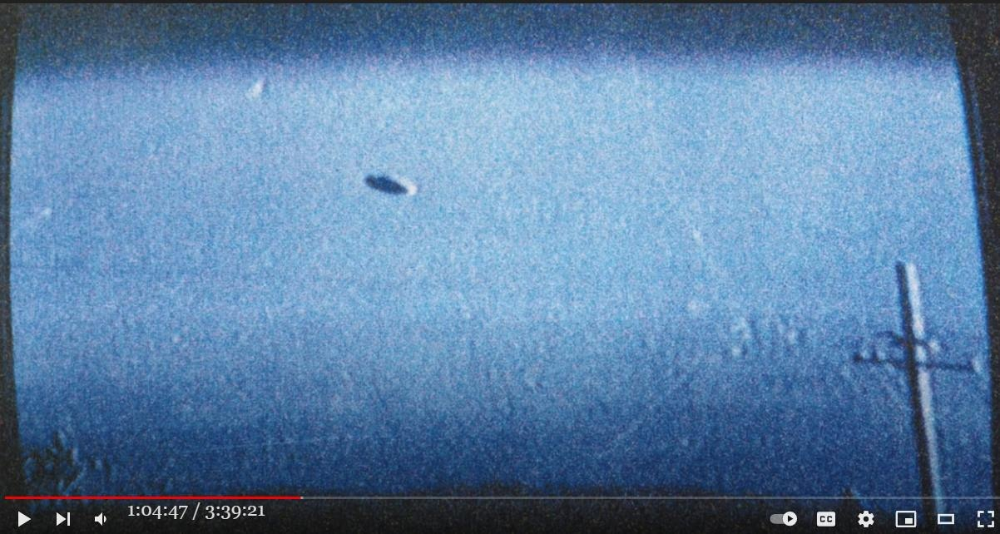 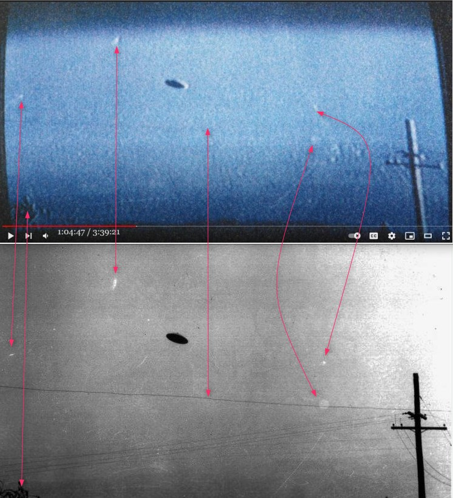 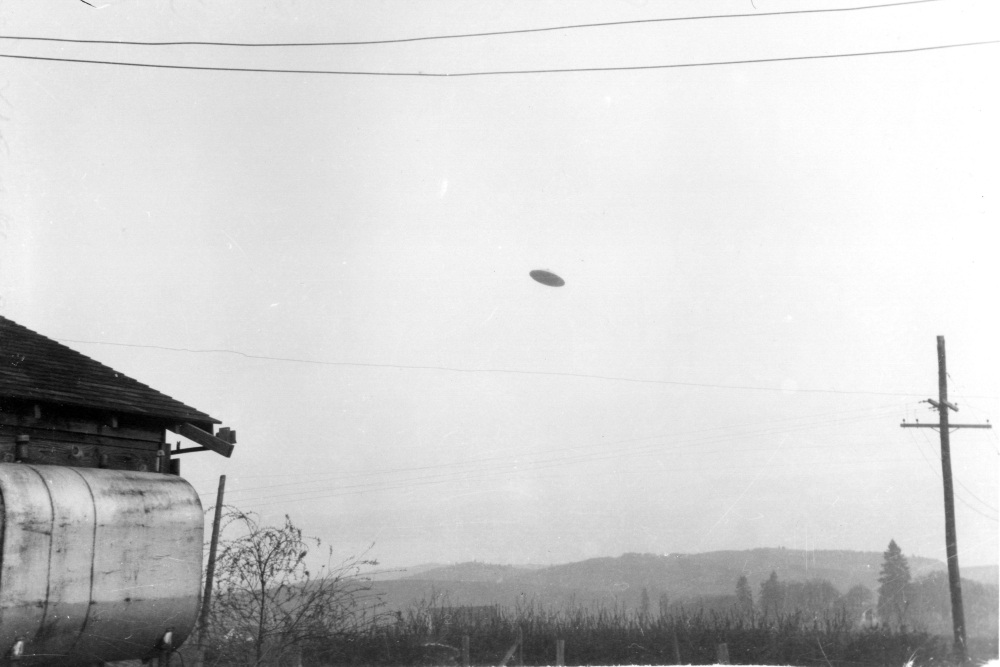

<pre>

<h3>前置き</h3>
- Linda Bradshaw （故人）は超常現象が多発する Bradshaw ranch の所有者（のひとり）だった。

- その Bradshaw Ranch を取材・放映した昔の TV 番組の中で Linda Bradshaw が UFO 目撃を証言し、その時に撮影した UFO の写真（下）が映されていた。

<a href="../img/20221010_linda0.jpg" target="_blank">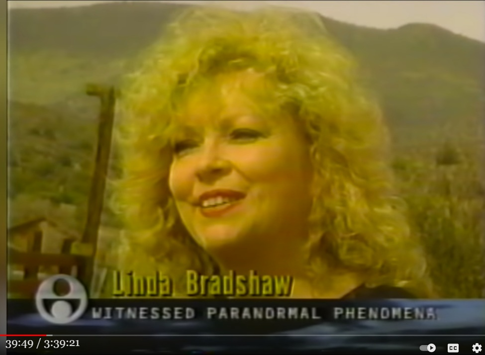</a>

<a href="../img/20221010_linda1.jpg" target="_blank">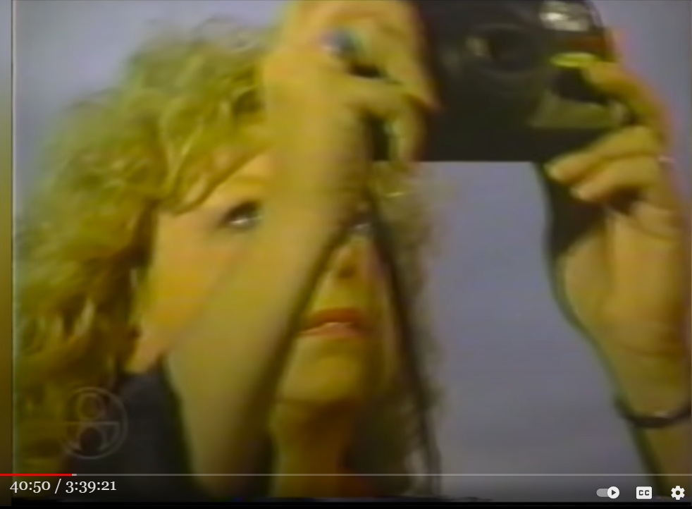</a>

<a href="../img/20221010_linda_pic1.jpg" target="_blank">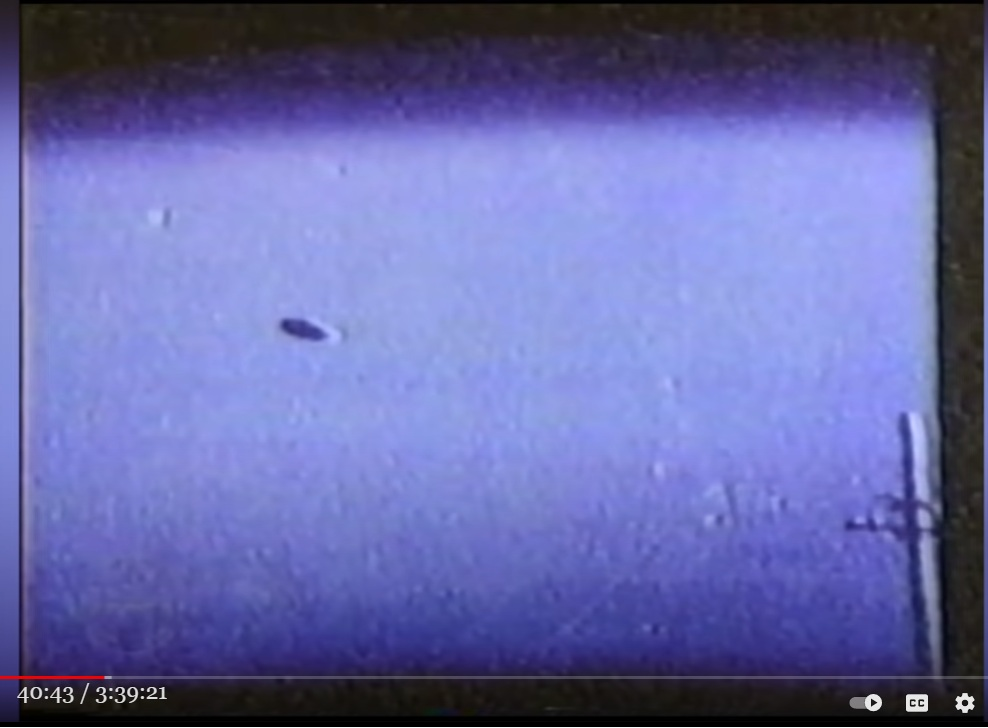</a>
<a href="../img/20221010_linda_pic2.jpg" target="_blank">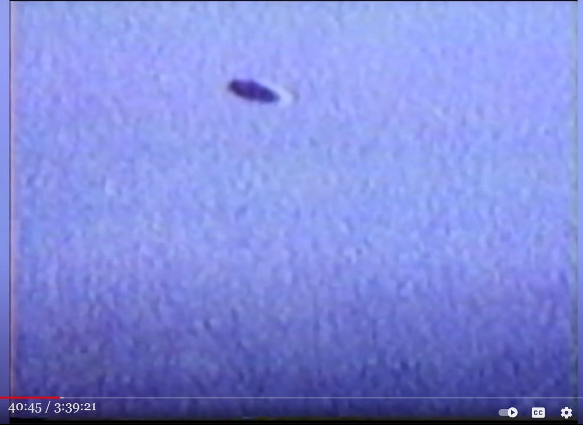</a>

<a href="../img/20221010_linda_pic3.jpg" target="_blank">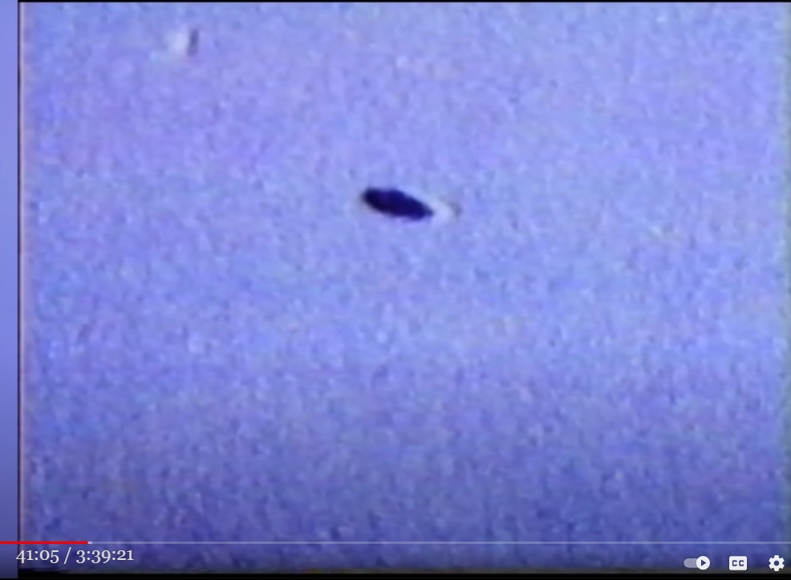</a>

<a href="../img/20221010_linda_pic4.jpg" target="_blank">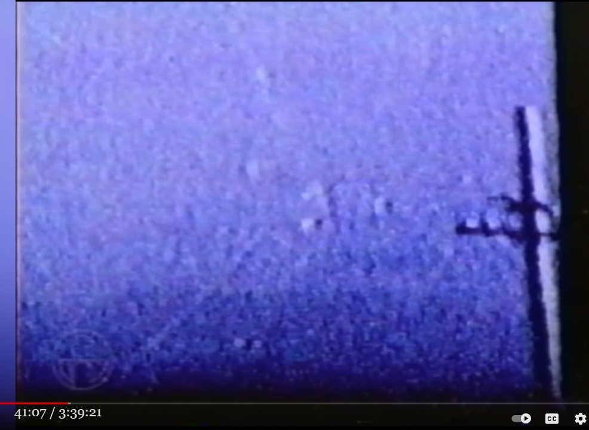</a>

<a href="../img/20221010_linda_pic5.jpg" target="_blank">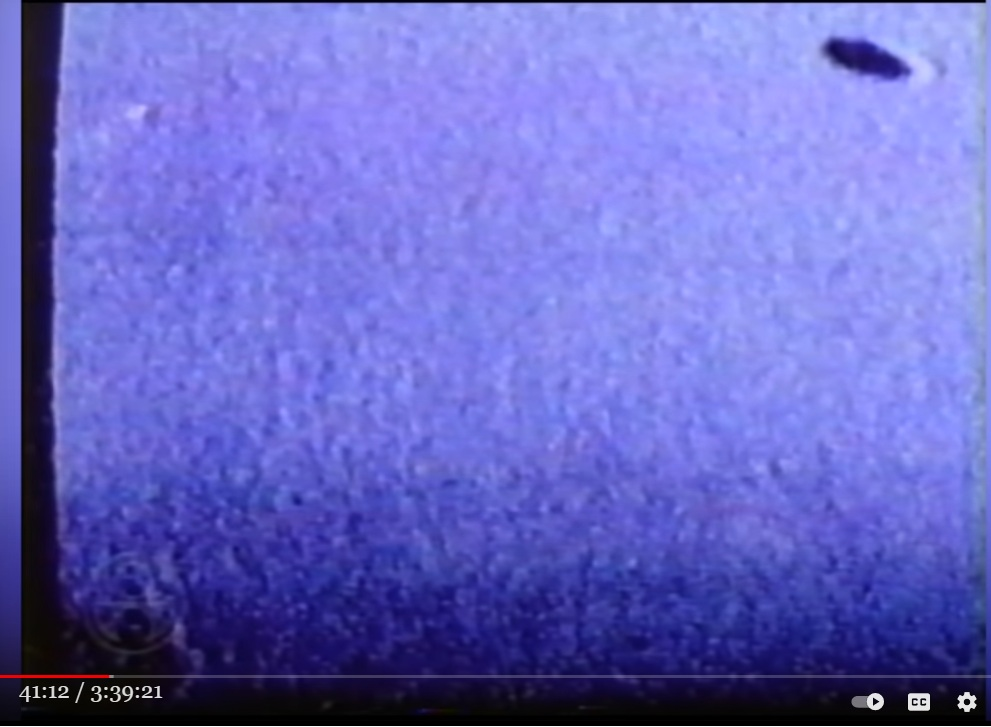</a>

<a href="../img/20221010_linda_pic6.jpg" target="_blank">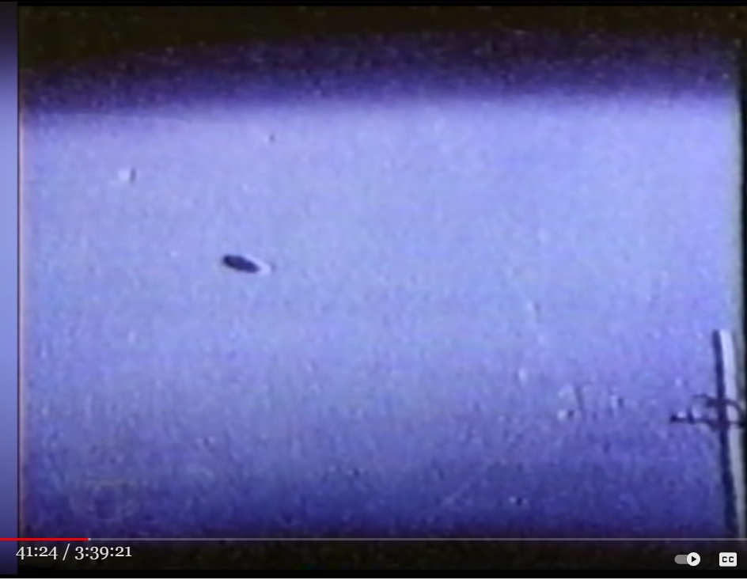</a>

<h3>Linda Bradshaw の証言</h3>
- Linda この UFO 撮影について次のように主張している。

　　・撮影場所である Bradshaw Ranch には電柱が存在しないので別空間、別次元が portal などを経由して写り込んだ。

　　・ET の姿も見えた。

40:38
luna got linda shot a strange photograph that appeared to her to be an enormous movie
40:44
screen in the sky a huge brilliant light showed up in the sky it was octangular i
40:49
got two frames before it flicked back out again all i could see with my eye was the
40:55
light but when i picked up the photograph there was
41:01
a picture of another place it showed a ship flying through the air
41:06
telephone pole there are no telephone poles here it almost looks like it might be on the shore of an ocean and there
41:12
was a humanoid in the far left corner we feel that this is indicative of
41:17
showing us that there is another dimension right here there is a connection there is an
41:23
opening

<h4>DeepL</h4>
リンダは奇妙な写真を撮った 空に巨大な映画のスクリーンがあるように 見えたそうだ
空には巨大な光が八角形に輝いていた。
2コマ撮ったところで、またはじき返され、私の目には光しか映らなかった。
しかし、その写真を手に取ると、そこには別の場所が写っていた。
別の場所の写真だった 空を飛ぶ船が写っていた
電柱......ここには電柱はない......まるで海の向こうのようだ......そして、左端に人型がいた
左端には人型が写っていました。私たちは、これが異次元の世界を示していると感じています。
別の次元がここにあることを示しているようだ。

<h4>動画(3:39:21)</h4>
HOODOO TALL - Full Documentary about the Bradshaw Ranch, Bigfoot, UFOS, and paranormal activity
<iframe width="560" height="315" src="https://www.youtube.com/embed/dj8yU1vnAH8" title="YouTube video player" frameborder="0" allow="accelerometer; autoplay; clipboard-write; encrypted-media; gyroscope; picture-in-picture" allowfullscreen></iframe>

<h3>疑念</h3>
- Bradshaw Ranch で目撃、撮影された UFO は全て現場地下に特有の結晶性鉱物が発生させた EMF 異常による orb だ…と私は判断している。

- だが、その判断をこの UFO 写真は反証しているかのように見える。なので、この UFO 写真を吟味してみた。

<h3>吟味した結果</h3>
- 問題の写真を眺めるとあることに気づく。そしてそれを少しばかり追求するだけで、この写真が捏造である決定的な証拠が出てくる。

- 100% 捏造である決定的な証拠が、下の対比で図解した写真。

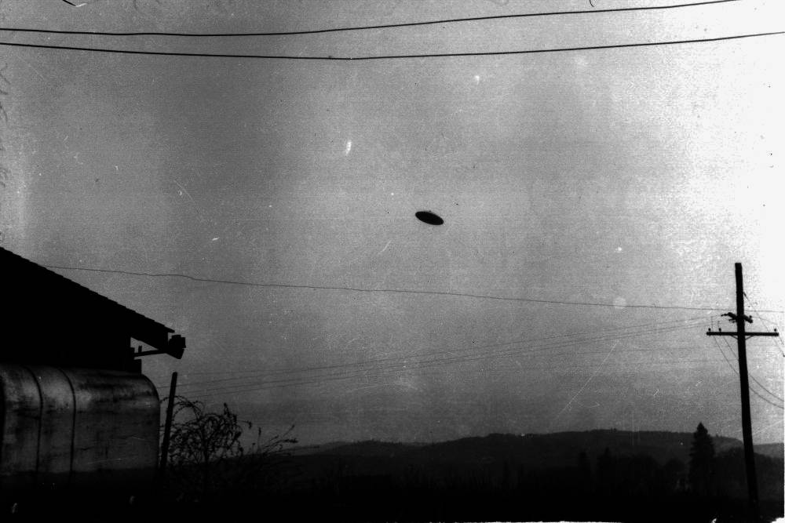

- すぐ上の写真は下のオリジナルの写真の明度などを調整したもので、元は McMinnville UFO 事件（1950）の写真(*1)の中の一枚だった。

<h4>(*1)</h4>
- McMinnville UFO 事件（1950）の写真のソース。

ref: https://i5.walmartimages.com/asr/80ace529-ad52-4d45-95bc-42de3c8f95be_1.21ad595f444903d5890a1cdbead3aa13.jpeg

- McMinnville UFO 事件（1950）の写真が捏造かどうかは本記事では扱わない。

- 参考
<a href="http://news21c.blog.fc2.com/blog-entry-2289.html" target="_blank">1950年5月11日、オレゴン州：初期の有名な UFO 写真の新たな捏造説</a> (2013-01-30)

<h3>結論</h3>
- Linda Bradshaw が撮影したという UFO 写真は、雑誌（確か Time 誌）に掲載された McMinnville UFO 事件の写真の一部を接写したもの。TV 画面からの接写かもしれない。

- つまり、上述の UFO 写真は Linda Bradshaw が故意に捏造したもの。同時に ET を目撃したという話も捏造。

- なお、Bradshaw Ranch での orb 目撃は多数の証言や動画映像もあるので事実と見て良い筈。Linda Bradshaw は、ちやほやされてつい UFO 写真を捏造してしまったのだろう。

- 誰かこの捏造に気づいている筈だと思って、ざっと検索したが Linda Bradshaw の UFO 写真が捏造だという指摘は見当たらないようだ。古い TV 番組が情報ソースなことも影響しているのだろう。

<h3>おまけ</h3>
- Linda Bradshaw が Tom Dongo に語った恐竜の目撃談（下の記事の件）もたぶん捏造だろう。

　　<a href="http://news21c.blog.fc2.com/blog-entry-20071.html" target="_blank">Tom Dongo の証言 : Bradshaw Ranch の所有者が恐竜を目撃 → 近くにいた私に叫んだ → 私は叫び声を聞いていない</a> (2022-10-10)

<h3>蛇足</h3>
- 音声書写（自動生成）の時刻表記のみを削除して改行、句読点なしのまま DeepL にかけている。記事作成に無駄な手間はかけたくない。なので DeepL 訳は補助程度。

(2022-10-10)

</pre>

