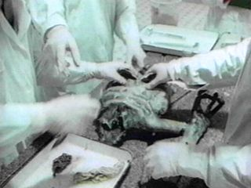
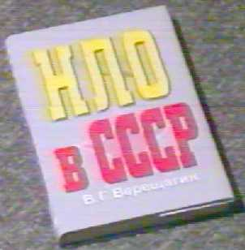
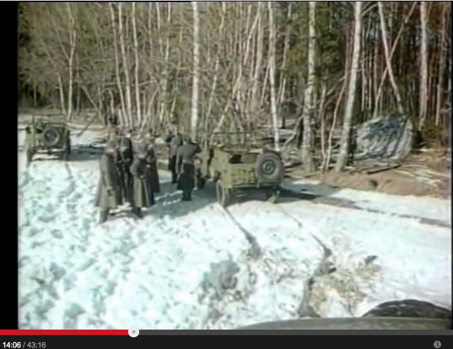
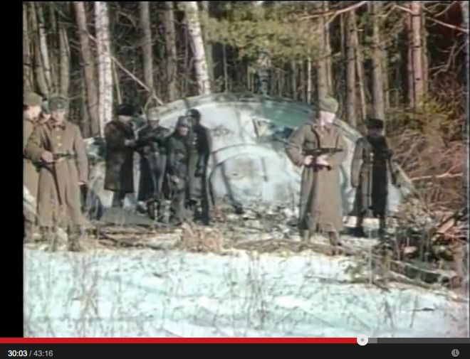
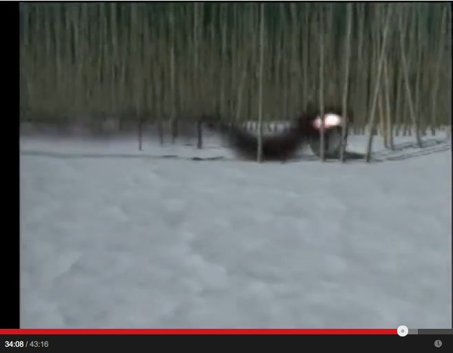

# 1969-03, ソビエト： UFO 墜落現場と異星人解剖シーンの動画（全体＋追加）

<h3>What's New</h3>

- （2014.06.18 追加）オリジナルの Roger Moore が司会を務めた動画を見かけたので追加。

<h3>はじめに</h3>

  

- 上の UFO の写真はあちこちでよく見かける。見るからに捏造くさい（現場の地形が墜落現場らしくない…など）が具体的な内容を把握していなかったので、ざっと調べてみた。

----

<h4>(2013.07.21 追加）</h4>

- この事件は捏造と断定できるようだ。その根拠は…

    - モスクワの映画会社が、墜落現場の UFO と兵士たちの撮影を、ハリウッドの映画制作会社から引き受けていた事が判明。撮影当日は風が強く、UFO は発泡スチロール製だったため、UFO が風に煽られ撮影は大変だったという証言もある…w

    - 現場の兵士役の人々に着せる昔の軍服を苦労して用意した衣装係の証言がある。その軍服も当時はまだ支給されていない筈のものだった。士官と兵士でベルトのバックルが異なる筈がそうなっていない。

    - 異星人の解剖シーンに登場していた医者の正体が判明しており（当時は医学生）、本人の証言も得ている。解剖シーンの撮影に使われた場所も特定された。

    - 放送では解剖に携わった医者の 3人が直後に脳の感染症で死亡したとされているが、その死亡証明書が明白な捏造と判明。

    - 放送で紹介されたこの事件に関する、現地の新聞記事の内容が捏造だと判明。

    - 以上のような暴露に対して有力な反論がなされていない。

- 上の追加部分だけで必要にして十分な気がしてきた。タイトルで（途中：その2）とかにしても後日、書き足す事も無さそうなのでこれで完結とする。細部に興味がある人は<a href="http://boris-shurinov.info/uftnt3-4/tnt3-4.htm" target="_blank" title="ソース">ソース</a>を見てクレヨン。

----

<h3>要旨（デタラメ）</h3>

- 日時：1968年3月

- 場所：ソビエト（near  Sverdlovsk）

- これは 1998年9月13日 20:00 に Turner Network Television (TNT) の  "TNT special" という TV 番組において『KGB の極秘ファイル』というタイトルで一般に放映された。この番組のナレーションと司会は 007 シリーズの James Bond（ジェームズ・ボンド）で有名な映画俳優の Roger Moore（ロジャー・ムーア）が務めた。

- その番組の中では墜落した UFO の回収現場の状況や、その UFO に搭乗していた異星人の解剖シーンも含まれている。この番組で使われた元の動画は旧ソ連の KGB の秘密ファイルを秘密裏に国外に持ちだしたものだとされ、その代価に 10,000ドルが支払われたと言われている。

- 番組のプロデューサーは、ソースはロシアから入手した、本物の KGB 撮影映像（16mm カラーフィルム）だ、と述べている。

- この墜落した UFO は 1969年3月（訳注：1968年3月というソースも見かけるがそれはミスだろう）にウラルの森で発見されたとされる。通報を受けたソ連軍が現場を固め、残骸の中から異星人の遺体を見つけたとされている。

- 下の動画はその一部。

<iframe allowfullscreen="" frameborder="0" height="360" src="https://www.youtube.com/embed/Ihd21dHa7oE?feature=player_detailpage" width="640"></iframe>

<iframe allowfullscreen="" frameborder="0" height="360" src="http://www.liveleak.com/ll_embed?f=234c935ae8c0" width="640"></iframe>

- この動画のソースは、KGB の秘密ファイルだというふれこみで、ロシアのブラックマーケットで流通していたと言われている。

……途中……

……途中……

……途中……

……途中……

<h3>肯定的な見解</h3>

- この事件を確認する幾つかの資料が存在している。また現場での回収任務を目撃したという証言者も存在する。解剖シーンで手術時の帽子やガウンを着用していないのが最初は異様に見えたが、調べてみると当時のロシアではこれが普通だった。

<blockquote>
There are also several documents shown to verify the event itself, and an eyewitness to the event who swears that the recovery mission did occur. The footage of the autopsy film shows personnel without caps and gowns, which seemed odd to me at first, but after some research I found that this was commonplace for that era in Russia.

  
ref: <a href="http://www.thinkaboutitdocs.com/1968-russian-ufo-crash-and-recovery/" target="_blank">http://www.thinkaboutitdocs.com/1968-russian-ufo-crash-and-recovery/</a>
</blockquote>

- この動画にある異星人の解剖が行われたことを支持する別の資料が存在している。

<blockquote>
The alien’s torso and arm are lying together on the table as the autopsy is performed, and there are documents shown to support the autopsy.

  
ref: <a href="http://www.thinkaboutitdocs.com/1968-russian-ufo-crash-and-recovery/" target="_blank">http://www.thinkaboutitdocs.com/1968-russian-ufo-crash-and-recovery/</a>
</blockquote>

<h3>否定的な見解</h3>

- 番組では最初に V.Vereschagin（下の写真） 

の書いた『ソビエト連邦における UFO』（ロシア語）という本（下の写真）

が紹介されている。この本によると………

- 1968年11月27日に Sverdlovsk（地名） の大勢の住民たちが UFO（複数）と爆発を目撃した。翌 1969年の春に Berezovsky（地名）の農民たちが 奇妙な円盤を発見し、 KGB に連絡した。KGB のカメラマンが現場と作業中の部隊を撮影した。その後、乗員だった異星人の解剖がモスクワで行われた。だが、 V.Vereschagin の書いたその本を見た人は誰もいない。本の表紙も一般的な出版物のそれとは違っている。ロシアでは Vereschagin という名前はありふれているが、UFO の分野ではそのような名前の人物は誰も知られていない。この番組で紹介された本は存在していないのだ。

<blockquote><pre>
The story begins by the book "UFOs in the USSR" (in Russian). 
     The author is introduced as V.Vereschagin,  whom no one  in the Russian UFO field  had ever heard of. 
     According to this unknown Vereschagin-ibn-TNT's  book UFOs in the USSR , many residents of the Sverdlovsk region had seen UFOs  and an explosion on November 27, 1968. The event was published in the Sverdlovsk newspaper. In the spring of 1969,  farmers in the area of Berezovsky found  strange disc and  contacted  the KGB.  KGB cameramen  filmed  the  site  and  the  troops' activity, and, later, im Moscow, the autopsy of an alien occupant.
Nobody has been able to even locate a copy of Vereschagin's alleged book, UFOs in the USSR,  in which the story of the crash  is supposedly told.  What we see  is just a jacket.  By the way, this jacket is not typical for our publishers.
     In Russia, there are many Vereschagin  but nobody knows  this one  in connection with the ufology. You can be sure, dear UpDates, that we know every book published in Russia and in Russian, and every person writing serious ufological books. This book does not exist.
</pre>
  
ref: <a href="http://boris-shurinov.info/uftnt/tnt2.htm" target="_blank">http://boris-shurinov.info/uftnt/tnt2.htm</a>
</blockquote>

- 回収現場で、兵士が銃を構えて警備しているが、彼の銃口が上官を含めてあらゆる方向に向かっている。警備兵は調警備対象から距離を取った位置にいるべきだし、捜査官や検査官に銃を向けるべきではない。

<blockquote>
"The guards seem to be located in a rather unorganized manner, and pointing their guns almost in any direction..., and even pointing at the apparently higher officers inspecting the object. The guards should preferably be located at some  distance from the object, and also pointing their armed guns in a direction away from the inspectors and investigators..."

 
ref: <a href="http://boris-shurinov.info/uftnt/tnt2.htm" target="_blank">http://boris-shurinov.info/uftnt/tnt2.htm</a>
</blockquote>

- ウラルの冬は極寒なのに、軍の車両にホロがついておらず夏用になっている。兵士たちがこれらの車両の上に並んで座っているが、実際の軍ではこれはありえない。

<blockquote>
 It is known that the winter in Ural is very cold. The cars we see are in summer version, without hood or canvas cover. Why? Because,  for the film-hoax,  it was necessary to show soldiers sitting in these cars. In reality, and especially  in the Army, it is not possible.

  
ref: <a href="http://boris-shurinov.info/uftnt/tnt2.htm" target="_blank">http://boris-shurinov.info/uftnt/tnt2.htm</a>
</blockquote>

- 軍の車両は 1950年頃の型の ZIS151 だが、これが軍で使われたことは無かった。捏造のために当時の軍の車両を探してくるのは難しかったのだろう。

<blockquote>
The truck in the film is a circa 1950 model ZIS151, which has not been used by the military for quite some time, and the truck would have been difficult to find to stage a hoax with.

 
ref: <a href="http://www.thinkaboutitdocs.com/1968-russian-ufo-crash-and-recovery/" target="_blank">http://www.thinkaboutitdocs.com/1968-russian-ufo-crash-and-recovery/</a>
</blockquote>

……途中……
……途中……
……途中……
……途中……

- 上の動画の解剖シーンで使われている青色のゴム手は当時、存在しなかったから捏造だという Youtube のコメント欄の意見もあるが、未確認。

<iframe allowfullscreen="" frameborder="0" height="360" src="https://www.youtube.com/embed/gRph1ink_aE?feature=player_detailpage" width="640"></iframe>

<embed allowfullscreen="true" allowscriptaccess="always" bgcolor="000000" flashvars="config=<a href=" height="270" http:="" src="http://alien-ufo-research.com/video-info/player.swf" target="_blank" width="420">

http://alien-ufo-research.com/russian_ufo_crash/russian-ufo-crash-video.xml&skin=http://alien-ufo-research.com/video-info/myskin.swf"></embed>
More <a href="http://alien-ufo-research.com/russian_ufo_crash/" target="_blank">About the Russian UFO Crash</a>

<h3>ソース</h3>
<a href="http://www.thinkaboutitdocs.com/1968-russian-ufo-crash-and-recovery/" target="_blank">http://www.thinkaboutitdocs.com/1968-russian-ufo-crash-and-recovery/</a>
<a href="http://www.ufoevidence.org/cases/case1138.htm" target="_blank">http://www.ufoevidence.org/cases/case1138.htm</a>
<a href="http://www.abovetopsecret.com/forum/thread314426/pg1#pid3694871" target="_blank">http://www.abovetopsecret.com/forum/thread314426/pg1#pid3694871</a>
<a href="http://www.ufodigest.com/news/1009/russian-disk2.php" target="_blank">http://www.ufodigest.com/news/1009/russian-disk2.php</a>

- 肯定的な立場：
<a href="http://www.ufocasebook.com/russia1969.html" target="_blank">http://www.ufocasebook.com/russia1969.html</a>

<a href="http://alien-ufo-research.com/russian_ufo_crash/" target="_blank">http://alien-ufo-research.com/russian_ufo_crash/</a>

- 懐疑的な立場：
<a href="http://members.tripod.com/~A_U_R_A/Alexhoax.html" target="_blank">http://members.tripod.com/~A_U_R_A/Alexhoax.html</a>

<a href="http://boris-shurinov.info/uftnt/tnt2.htm" target="_blank">http://boris-shurinov.info/uftnt/tnt2.htm</a>

<h3>履歴</h3>

(2013.07.20) 作成
(2013.07.21) 追加

（以下、2014.06.18 追加）

- 上で言及したジェームズ・ボンド役で有名な Roger Moore が司会を務めたドキュメンタリー動画が Youtube にあった。オリジナルの動画は 1.5時間にもなる。多くの事例が網羅的に紹介され、上の捏造動画はその目玉的扱いとなっている。

- 動画（43分バージョン）の 13:00 ごろから上で問題としたシーンを含む捏造動画が始まるが、一箇所にまとまって紹介されているわけではなく、ドキュメンタリー動画のあちこちに切り刻んで散りばめられている。

- 幾つかのシーンを切り出した静止画が下。

墜落状況の再現CG

<h3>動画（43分）</h3>
- UFO The Secret KGB UFO Files CD1 
<iframe allowfullscreen="" frameborder="0" height="360" src="//www.youtube.com/embed/9pkHK8ZSVMY?feature=player_detailpage" width="640"></iframe>

<h3>動画（66分）</h3>
- THE SECRET KGB PARANORMAL FILES@wampsmania com
<iframe height="360" src="//www.youtube.com/embed/EQ6zShF0h7Q?feature=player_detailpage" width="640"></iframe>

<h3>動画（88分）</h3>
- The Secret KGB UFO Files Complete - NL sub 
frameborder="0" allowfullscreen>
<iframe allowfullscreen="" frameborder="0" height="360" src="//www.youtube.com/embed/AmF5ED0sPOk?feature=player_detailpage" width="640"></iframe>

(2014.06.18)

## 初出
<a href="http://news21c.blog.fc2.com/blog-entry-4158.html" target="_blank">1969年3月、ソビエト：UFO 墜落現場と異星人解剖シーンの動画（全体＋追加）</a> (2014-06-18)

